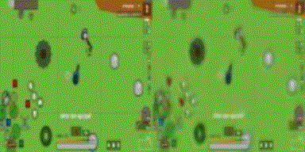

<div align="center">
  


[](https://opensource.org/licenses/MIT)
[](https://opendatascience.slack.com/archives/CJW0A6U78/p1632648992121300?thread_ts=1632648992.121300&cid=CJW0A6U78)

[]()
[]()
[]()
</div>

## Задача на ODS-хакатон 5.02-20.02
1. Игра surviv.io не имеет окружения, в котором можно было бы обучить RL-агента. Окружение, оно же environment - функция, принимающая в себя текущее состояние среды и действие агента, а возвращающая - следующее состояние и награду. Т.е. S_next,Reward=ENV(S_curr,Action).
2. Текущая версия агента получена с помощью алгоритмов offline reinforcement learning
3. Идея - создать модель, выполняющую функции окружения, которая бы предсказывала следующий кадр, если известен текущий кадр и действие агента, т.е. State_next = MODEL(State_curr,Action)
4. Идея не нова, существует статья и модель [GameGAN](https://nv-tlabs.github.io/gameGAN/).
5. Энтузиасты уже применили GameGAN к GTA, получив [GANTheftAuto](https://github.com/Sentdex/GANTheftAuto)
6. После создания модели - нейронного движка игры, можно получить более сильного агента (научить лутать, правильно двигаться)
7. Данные есть, сервер для вычислений есть, идеи есть, а рук - не хватает, поэтому - присоединяйтесь
8. Уже есть некоторые наработки (без применения GameGAN) по нейронному движку (но нужно улучшать). Ниже пример одной из моделей, которая возвращает следующий кадр агенту: слева - начальный кадр, справа - некоторая траектория рандомного агента (который случайным образом выбирает направление своего движения)
<div align="center">
  

  
</div>

# Intro
We present our **machine learning bot** (ml-bot is in alpha testing), which can play the [surviv.io](https://surviv.io/) game.

This bot tries to solve only **the locomotion problem** by training on human gameplay and processing the incoming frame-picture with its **Deep Learning algorithms**. To train this agent, we have used [100 youtube-videos](for_annotators/video_data) containing 1.2 million frames (equivalent to ~12 hours of gameplay recordings). Anyone can run the bot on their device (see below our `Installation guides`).

#### Current agent's features:
- our bot can get closer to the boxes with loot
- our bot knows how to avoid red zone
- our bot is trying to get out of the red zone (if the zone has covered it)
- our bot begins to move chaotically, when enemies shoot at him
- our bot likes to build a route through the bushes

#### Further backlog:
- improve the agent's movement
- train the agent to properly interact with the loot and with the cursor, shoot, use helpful items
- optimize the agent control architecture
- delve deeper into RL algorithms

# Motivation
The goal is to develop a bot that is interesting to watch. The behavior of the bot should not differ from the behavior of a person in similar situations. Our research will help raise the level of AI in games, make games more interesting, and bots in them more similar to the actions of a real person.

We assume that if people are interested in watching other gamers (professional or not) through [twitch](https://www.twitch.tv/), then they will be interested in watching our agent as well. 

# Technical stack


- offline reinforcement learning
- python3
- selenium *(agent actions execution in game environment)*
- openCV *(screenshots processing)*
- torch *(action selection)*
- mss *(do screenshots)*


# Installation guides

<details>
  <summary>Ubuntu\MacOS</summary>
  
  ## Initial usage
  __1. Clone GitHub repository__
  
  ```
  git clone https://github.com/Laggg/ml-bots-surviv.io
  ```

  __2. Download supporting files__

  Download model weights from [here](https://drive.google.com/u/0/uc?id=1l3exfxwT4ZVk1R6V2sxZimTafx1EkNtO&export=download) and chromedriver, that suits your chrome version, from [here](https://chromedriver.chromium.org/downloads) (unzip it, if needed). 

  Locate both files to `./supporting_files/` folder.

  >
  
  __3. Create python virtual environment and install requirements.txt__
  
  ```
  cd ml-bots-surviv.io
  python -m venv surviv_env 
  source surviv_env/bin/activate
  pip install -r requirements.txt 
  ```
  <details>
    <summary>possible issues: </summary>
    
    Issue: Could not build wheels for opencv-python which use PEP 517 and cannot be installed directly
    Solution: `pip install --upgrade pip setuptools wheel`
  </details>


  __4. Run the agent__
  ```
  python play.py
  ```
  
  ## Later usage

  __1. Activate python environment__
  ```
  source surviv_env/bin/activate
  ``` 

  __2. Run the agent__
  ```
  python play.py
  ```
</details>

<details>
  <summary>Windows</summary>
  
  ### Before the first launch
  
  **1.** Check that you have `Anaconda3` with `python3`

  **2.** Check that you have `google chrome browser` (our agent supports only chrome)

  ### For the first launch
  
  **0.** Earlier you do 1-2 steps from paragraph **"Before the first launch"**

  **1.** Clone repo by `Anaconda Prompt` or dowland zip-file repo and unzip it
  ```
  git clone https://github.com/Laggg/ml-bots-surviv.io.git
  ```
  **2.** Dowland neural net weights from [source](https://drive.google.com/u/0/uc?id=1l3exfxwT4ZVk1R6V2sxZimTafx1EkNtO&export=download) and put it into `./supporting_files/` folder

  **3.** Dowland driver for your OS and for your chrome version (don't forget to check your google chrome version!) from [link](https://chromedriver.chromium.org/downloads), unzip it and put into `./supporting_files/` folder

  > after 3rd step you can check `./supporting_files/` folder:
  >> 

  **4.** Open Anaconda prompt inside repo-folder
  > example:
  >> 

  **5.** Create a virtual environment for this project
  ```
  python –m venv surviv_env
  ```
  **6.** Activate created virtual environment
  ```
  cd surviv_env/scripts && activate && cd ../../
  ```
  **7.** Install all required libraries
  ```
  pip install -r requirements.txt
  ```
  **8.** Launch the agent into the game!
  ```
  python play.py
  ```
  **9.** After all you can deactivate virtual env and close `Anaconda prompt` window

  ### For the second+ launch
  
  **0.** Earlier you do 1-9 steps from paragraph **"For the first launch"**

  **1.** Open `Anaconda prompt` inside repo-folder

  **2.** ```cd surviv_env/scripts && activate && cd ../../```

  **3.** ```python play.py```

  **4.** After all you can close deactivate virtual env and close `Anaconda prompt` window
  
</details>
