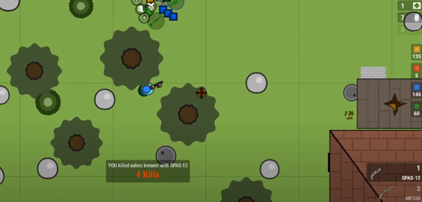

# Intro
We present our **machine learning bot** (ml-bot is in alpha testing), which plays the [game](https://surviv.io/) itself.



This bot tries to solve only **the locomotion problem** by training on human letsplays.

Main features:
- our bot can get closer to the boxes with loot
- our bot knows how to avoid red zone
- our bot is trying to get out of the red zone (if the zone has covered it)
- our bot begins to move chaotically, when enemies shoot at him
- our bot likes to build a route through the bushes

# Motivation
The goal is to develop a bot that was interesting to watch. The behavior of the bot should not differ from the behavior of a person in similar situations. We assume that if people are interested in watching other people's professional games through [twitch](https://www.twitch.tv/), then they will be interested in watching our agent as well. Our research will help raise the level of AI in games, make games more interesting, and bots in them more similar to the actions of a real person.

# Technical stack
- python3
- selenium *(play game)*
- openCV *(preprocess screenshots)*
- torch *(choose action)*
- mss *(do screenshots)*

# Installation guide for Windows

<details>
  <summary>see guide for Windows</summary>
  
  ### Before the first launch
  **1.** Check that you have Anaconda3 with python3

  **2.** Check that you have google chrome browser (our agent supports only chrome)

  ### For the first launch
  **0.** Earlier you do 1-2 steps from paragraph *Before the first launch*

  **1.** Clone repo by *Anaconda Prompt* or dowland zip-file repo and unzip it
  ```
  git clone https://github.com/Laggg/ml-bots-surviv.io.git
  ```
  **2.** Dowland neural net weights from [this link](https://drive.google.com/u/0/uc?id=1l3exfxwT4ZVk1R6V2sxZimTafx1EkNtO&export=download) and put it into *./supporting_files/* folder

  **3.** Dowland driver for your OS and for your chrome version (don't forget to check your google chrome version!) from [link](https://chromedriver.chromium.org/downloads), unzip it and put into *./supporting_files/* folder

  > after 3rd step you can check *./supporting_files/* folder:
  >> 

  **4.** Open Anaconda prompt inside repo-folder
  > example:
  >> 

  **5.** Create a virtual environment for this project
  ```
  python –m venv surviv_env
  ```
  **6.** Activate created virtual environment
  ```
  cd surviv_env/scripts && activate && cd ../../
  ```
  **7.** Install all required libraries
  ```
  pip install -r requirements.txt
  ```
  **8.** Launch the agent into the game!
  ```
  python play.py
  ```
  **9.** After all you can deactivate virtual env and close Anaconda prompt window
  
  ### For the second+ launch
  **0.** Earlier you do 1-9 steps from paragraph *For the first launch*

  **1.** Open Anaconda prompt inside repo-folder

  **2.** ```cd surviv_env/scripts && activate && cd ../../```

  **3.** ```python play.py```

  **4.** After all you can close deactivate virtual env and close Anaconda prompt window
</details>

# Installation guide for Ubuntu\MacOS

<details>
  <summary>see guide for Ubuntu\MacOS</summary>
  
  ### [For the first launch]
  **1.**
  
  ```
  git clone https://github.com/Laggg/ml-bots-surviv.io
  ```
  
  **2.** Use terminal in this repo-folder
  
  ```
  python3 -m venv surviv_env 
  source surviv_env/bin/activate
  pip install -r requirements.txt 
  ```
  
  **3.**
  ```
  python play.py
  ```
  
</details>
